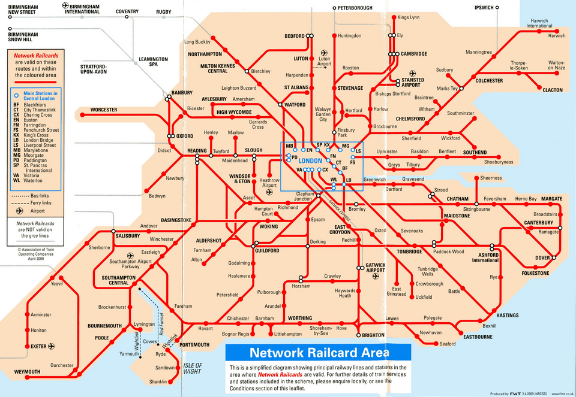
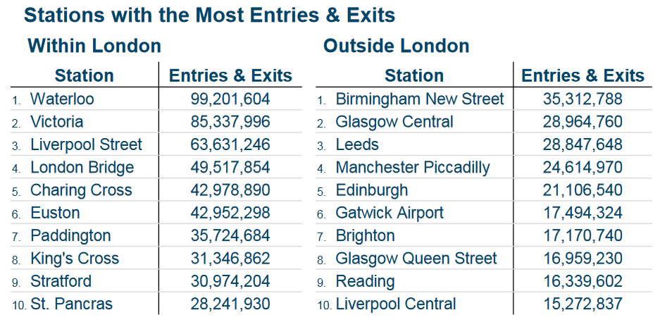
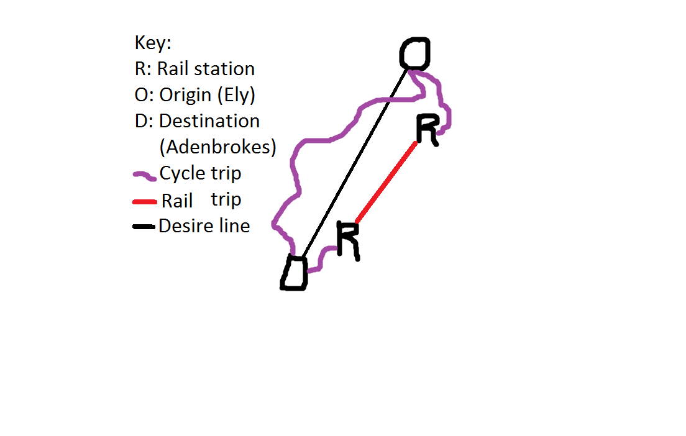

```{r setup, include=FALSE}
library(knitr)
opts_chunk$set(echo = FALSE, warning = FALSE, message = FALSE)
```

# The Propensity to Cycle Tool

## Motivation | Lack of strategic cycle networks

What is the PCT?

- An open source, publicly accessible web-based tool for assessing the geographical distribution and potential benefits of cycling potential nationwide

- Best illustrated in a demo: http://pct.bike/

## What kind of questions can it help answer?

> - Where should we build for existing cyclists?
> - New cyclists in the medium term?
> - Long-term strategy?
> - Along which routes to create the strategic joined-up network?

## Phase I (Feb - July 2016)

> - Build and test a prototype model
> - Identify 'desire lines' of greatest potential
> - Make the tool scalable nationally
> - Create a website that will make the Propensity to Cycle Tool a publicly accessible resource

## Phase II (January 2016 - March 2017)

**Version 1 - nationwide (V1 launch: June 2016)**

> - Route-allocated hilliness, network layer (complete)
> - Include health outcomes (HEAT)
> - National-level results (Anna Goodman)
> - V1.5 - smaller (LSOA) zones (Jan 2017)
> - Training

**Version 2 - local deployment**

> - Include non-commute trips
> - Compatibility with Local Authority trip demand models
> - Micro-level analysis (V 2.2)

## Additional work/spin outs

> - Case studies of use (e.g. Manchester, Kent, Yorkshire)
> - Method for identifying severance
> - Case study along HS2 route
> - 'Hackathons' to stimulate the tool's development

## Interactive map of current flows


## Route allocation


## Route network analysis


## Zoom to a specific area


## 4 scenarios of change

- Government Target
- Gender Equality
- Go Dutch
- Ebikes


# Data sources for cycling potential to stations 

## Warning: We'll be using R code | Using the following packages

```{r, echo=TRUE}
pkgs = c(
  "stplanr", # transport data handling
  "sp", # package for spatial data
  "tmap", # package for mapping
  "deldir", # voronoi polygons
  "readr", # fast read/write
  "rgeos", # gis functions
  "dplyr" # data analysis
)
lapply(pkgs, library, character.only = T)
```


## Where are they? | Source: http://www.projectmapping.co.uk/

```{r}

```

## Downloading official data on stations | Source: [data.gov.uk](https://data.gov.uk/dataset/naptan)

```{r, echo=TRUE, eval=FALSE}
u = "http://www.dft.gov.uk/NaPTAN/snapshot/NaPTANcsv.zip"
zf = file.path(tempdir(), "NaPTANcsv.zip")
download.file(url = u, destfile = zf)
unzip(zf, exdir = tempdir())
stations = read_csv(file = file.path(tempdir(), "stops.csv"))
rail = filter(stations, StopType == "RSE")
saveRDS(rail, "data/rail.Rds")
```

```{r analysis-naptan, eval=FALSE}
stations
unique(stations$StopType)
```

## The naptan data | What does it mean? Details: [gov.uk](https://www.gov.uk/government/uploads/system/uploads/attachment_data/file/365271/background-information-naptan.pdf)

```
# A tibble: 6 x 43
      ATCOCode NaptanCode PlateCode CleardownCode                CommonName CommonNameLang ShortCommonName ShortCommonNameLang Landmark
         <chr>      <chr>     <chr>         <chr>                     <chr>          <chr>           <chr>               <chr>    <chr>
1 0100BRP90087    bstgtaw                                  Brunswick Street             en                                             
2 0100BRP90088    bstgtjp                                   Brigstocke Road             en                                             
3 0100BRP90089    bstgtpj                                   Brigstocke Road             en                                             
4 0100BRP90090    bstgwgm                                    Denbigh Street             en                                             
5 0100BRP90091    bstgwta                                    Denbigh Street             en                                             
6 0100CLFDOWN0                                    Clifton Down Rail Station             en                                             
# ... with 34 more variables: LandmarkLang <chr>, Street <chr>, StreetLang <chr>, Crossing <chr>, CrossingLang <chr>, Indicator <chr>,
#   IndicatorLang <chr>, Bearing <chr>, NptgLocalityCode <chr>, LocalityName <chr>, ParentLocalityName <chr>,
#   GrandParentLocalityName <chr>, Town <chr>, TownLang <chr>, Suburb <chr>, SuburbLang <chr>, LocalityCentre <int>, GridType <chr>,
#   Easting <int>, Northing <int>, Longitude <dbl>, Latitude <dbl>, StopType <chr>, BusStopType <chr>, TimingStatus <chr>,
#   DefaultWaitTime <chr>, Notes <chr>, NotesLang <chr>, AdministrativeAreaCode <chr>, CreationDateTime <time>,
#   ModificationDateTime <time>, RevisionNumber <int>, Modification <chr>, Status <chr>
```

## The geographical distribution of stations

```{r, eval=TRUE, echo=TRUE}
rail = readRDS("data/rail.Rds")
coordinates(rail) = ~Longitude+Latitude
plot(rail)
```

## Usage stats | Source: [Office of Rail and Road](http://orr.gov.uk/statistics/published-stats/station-usage-estimates)

```{r}

```

For more info: see this [infographic](http://orr.gov.uk/__data/assets/pdf_file/0003/15366/station-usage-infographic.pdf) on usage stats.

## Case study data: Cambridge | Data from the PCT: [pct.bike/cambridgeshire/](http://pct.bike/cambridgeshire/)

```{r, echo=TRUE}
z = readRDS("../pct-data/cambridgeshire/z.Rds")
qtm(z) +
  qtm(rail, bubble.size = 0.3)
```

# Methodology

## Splitting a single line in 3

```{r, out.width="130%"}
proj4string(rail) = proj4string(z)
# rail_cam = rail[z,] # save cambridge rail stations
# saveRDS(rail_cam, "data/rail_cam.Rds")

source("R/voronoi.R")
cam_outline = rgeos::gBuffer(z, width = 0)
```

## Identifying shortest paths

- Various ways of doing this
- Voronoi polygons is most visual:

```{r, echo=TRUE}
rail_cam = readRDS("data/rail_cam.Rds")
voronai = deldir(rail_cam$Easting, rail_cam$Northing)
plot(voronai) 
```


## Find closest stations

```{r}
cents = readRDS("../pct-data/cambridgeshire/c.Rds") # load centroids
proj4string(cents) = proj4string(z)
mat = apply(gDistance(rail_cam, cents, byid=TRUE), 1, which.min)
plot(cents, col = mat)
```

## Create travel travel to station 'desire lines'

```{r, echo=TRUE}
for(i in 1:nrow(cents)){
  o = cents[i,]
  d = rail_cam[mat[i],]
  od = sbind(SpatialPoints(o), SpatialPoints(d))
  if(i == 1)
      L = SpatialLines(list(Lines(list(Line(coordinates(od))),"X"))) else
        L = sbind(L, SpatialLines(list(Lines(list(Line(coordinates(od))),"X"))))
}
ld = SpatialLinesDataFrame(L, cents@data["rail"], match.ID = F)
```

## The results

```{r, echo=FALSE}
qtm(z) +
  qtm(rail, bubble.size = 0.3) +
  tm_shape(ld) + tm_lines(lwd = "rail", scale = 20)
```


## Concept: from a hackathon

<blockquote class="twitter-tweet" data-lang="en"><p lang="en" dir="ltr">Using <a href="https://twitter.com/robinlovelace">@robinlovelace</a> tool (stplanr, modified) to review <a href="https://twitter.com/cyclestreets">@cyclestreets</a> journeys from their API, with <a href="https://twitter.com/qgis">@qgis</a>. <a href="https://t.co/t17LebZFJu">pic.twitter.com/t17LebZFJu</a></p>&mdash; Matt Turner (@MattTurnerSheff) <a href="https://twitter.com/MattTurnerSheff/status/693828390059655169">January 31, 2016</a></blockquote>
<script async src="//platform.twitter.com/widgets.js" charset="utf-8"></script>


# Further work

## Identify the problem we're trying to solve

- Building cycle paths to stations (layer in the PCT)
- Identify where there's a short-fall of cycle parking?
- Identify target areas to incentivise to cycle?
- Provision of cycles at 'arrival station'

## Work that needs to be done:

- Find if rail is a viable option for non-rail trips
     - Trains may alread by at capacity (e.g. Ely)
     - Many destinations are not close to rail stations
- Find if nearest station is suitable per rail commuter
        - People may not go to the nearest station
        - TransportAPI or Google's Distance Matrix API can help
- Explore travel options upon arrival at 'destination station'
- Get data on cycle facilities at stations

